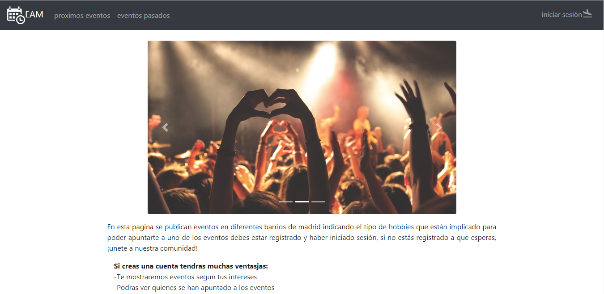
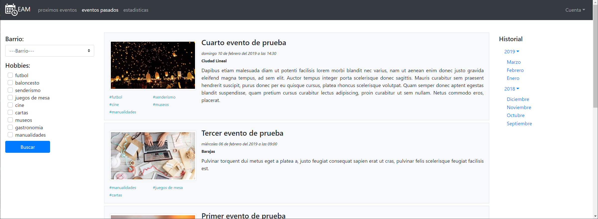
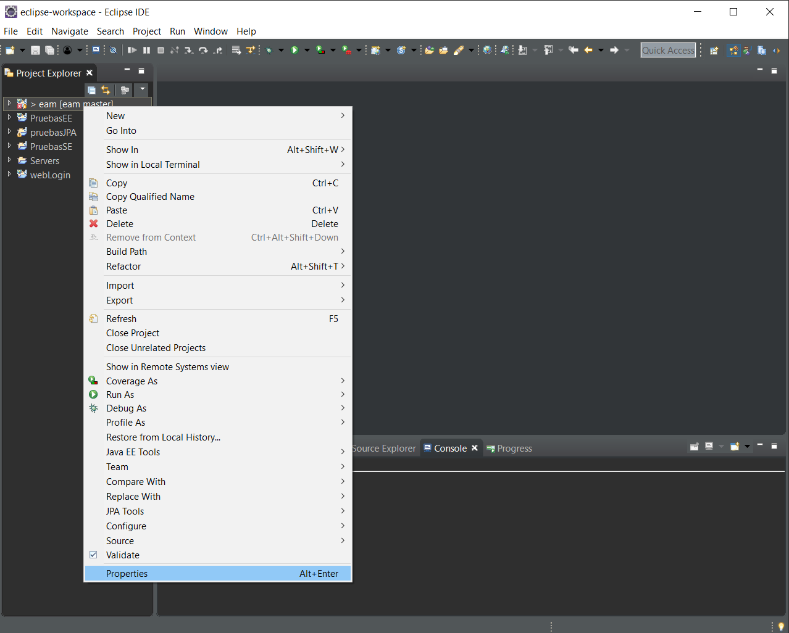
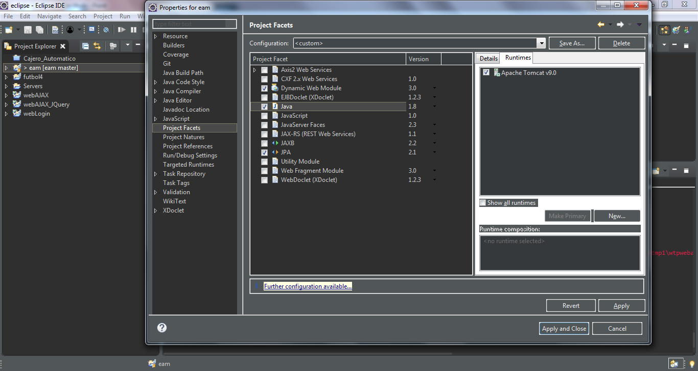
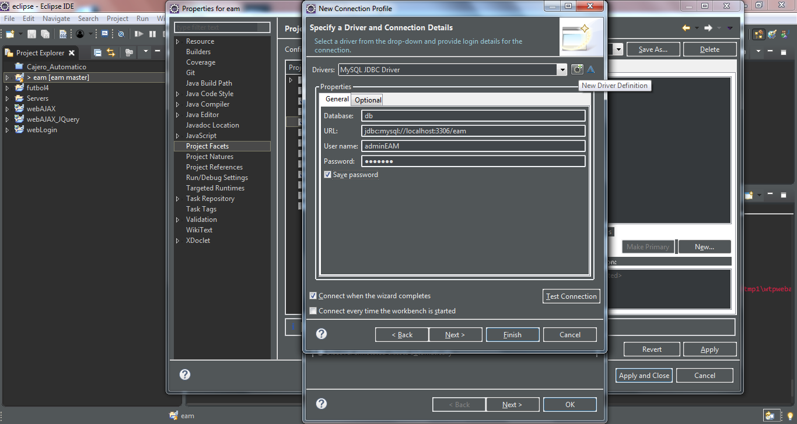
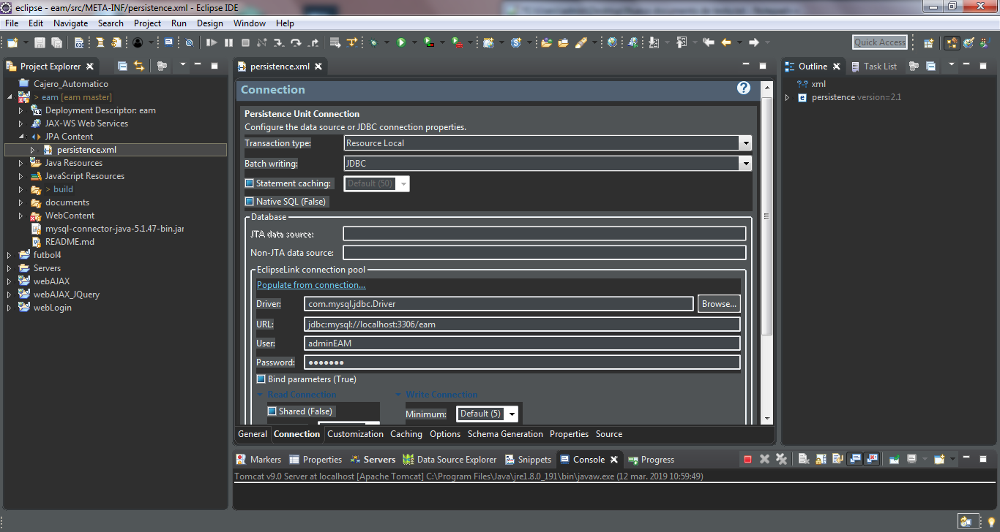

# Eventos y Actividades en Madrid

Pagina web en la que puedes mirar eventos que se realizarán en tu barrio entre los usuarios de la web

HOME


EVENTOS


## Prerrequisitos

* Tener la BD instalada, en documents/queries.sql está el codigo para generar la DB en MySQL
* Tener Apache Tomcat 9 instalado

## Instalacion

* clonar el proyecto
* importar en eclipse como proyecto normal (File > Import... > General > Projects from Folder or Archive)
```suele dar error al importar como proyecto git```

* configurar
** eam > properties
***		Project Facets
****		activar runtimes > Apache Tomcat v9.0
****		activar Dynamic Web Module
****		activar JPA
****		cambiar version de java a 1.8

***		JPA:
****		Platform > EclipseLink 2.5.2
****		Connection > MySQL
*****			Driver
******				Name/Type > 5.1
******				JAR List > Edit > elegir el driver del proyecto (mysql-connector-java-5.1.47-bin)
*****			Properties > general

**	eam > JPA Content > persistence.xml > Connection > eclipse connection pool > (la misma configuracion de antes)

**	servers > new Server (si no estuviera ya) > Apache > Tomcat v9.0 Server > Next > Add > eam

## Creado con

* JavaScript
* CSS
* Bootstrap
* JQuery
* Google Charts
* Java
* JPA
* MySQL

## Colaboradores

* Paul Barzallo
* Alvaro Villanova
* Borja Gomez-Rey