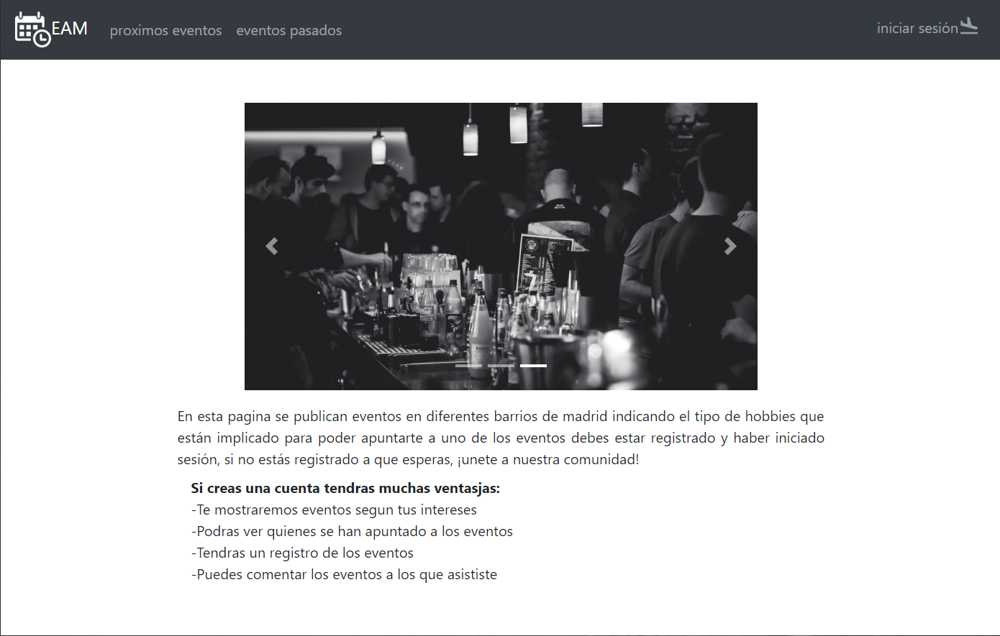
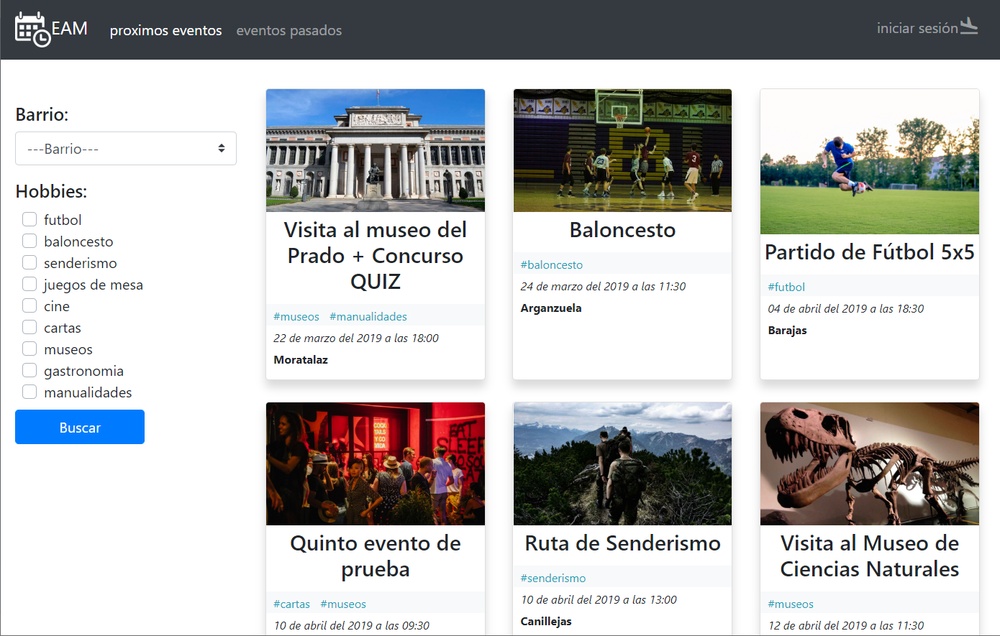
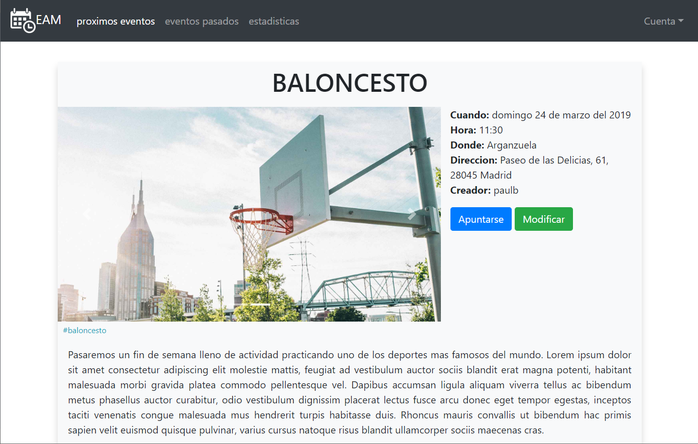
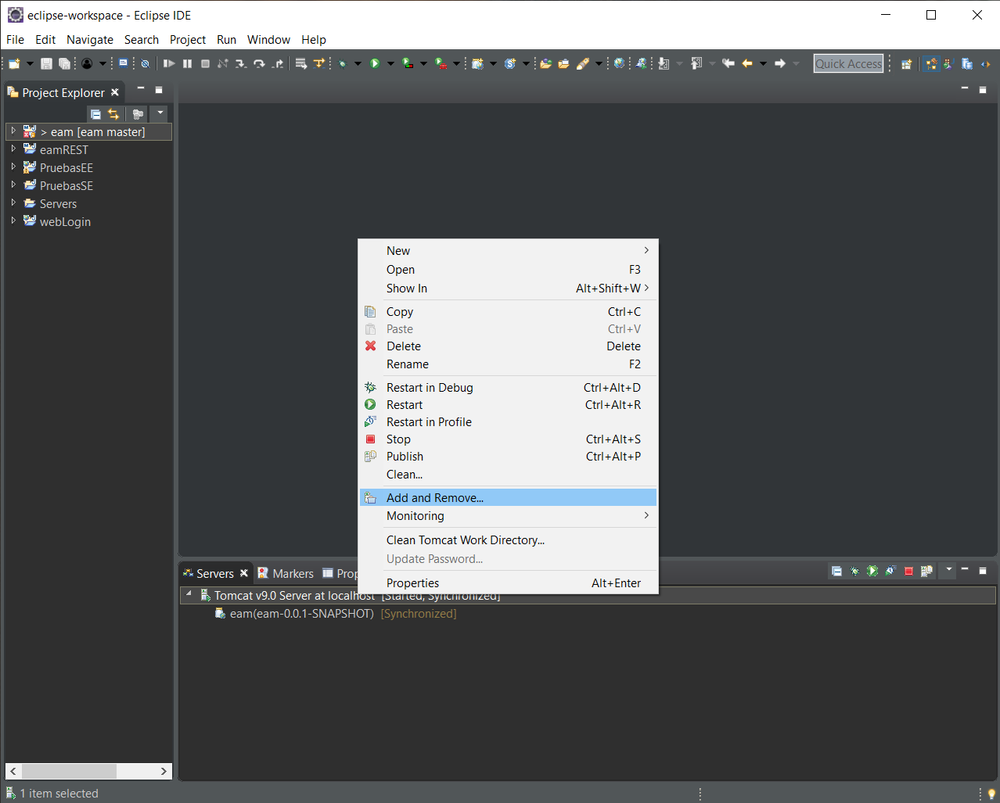

# Eventos y Actividades en Madrid

Pagina web en la que puedes mirar eventos que se realizarán en tu barrio entre los usuarios de la web

HOME


EVENTOS


EVENTO


## Prerrequisitos

* Tener la BD instalada, en 'documents/queries.sql' está el codigo para generar la DB en MySQL
* Tener Apache Tomcat 9 instalado

## Instalacion

* clonar el proyecto
* import -> General > Projects from Folder or Archive
* servers -> Tomcat v9.0 -> Add and Remove

```
puede dar error de 'FileNotFoundException' al principio porque tarda un rato en configurar los archivos
```

## Creado con

* JavaScript
* CSS
* Bootstrap
* JQuery
* Google Charts
* Java
* JPA
* MySQL

## Colaboradores

* Paul Barzallo
* Alvaro Villanova
* Borja Gomez-Rey